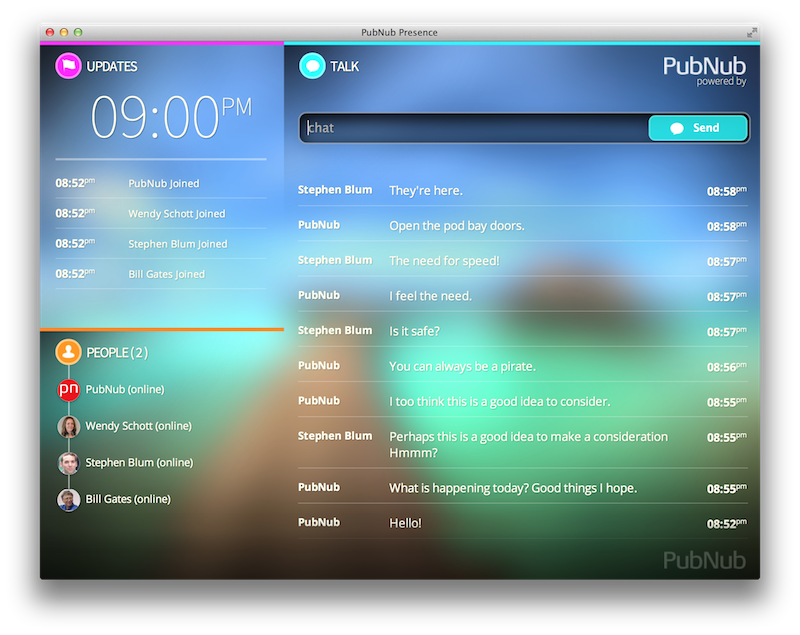

# HTML5 WebSockets Real-time Chat on Mobile using PubNub's new Global Presence

## Live HTML5 WebSockets App with Presence - Open Source MIT

[Live PubNub Presenece App](http://pubnub.s3.amazonaws.com/rally/index.html)
 - SCREENSHOT HERE!!!
 - VIDEO 1
 - VIDEO 2

## Presence

PubNub is the first Earth Scale infrastructure
to provide Global User Presence for Channel Connectivity and Occupancy.
Presence is a new type of framework that never existed before allowing you to
receive user discovery events on a PubNub <code>channel</code> instantly.
This enables imperative new capabilities in your app:
starting with <strong>User Events</strong> such as Join/Leave Status Changes.
Also channel analytics such as number of users actively receiving
or waiting to receive data on a <code>channel</code>.

Real-time Web for Mobile Apps and Web Apps is now amazing and
mega powerful with in the advent of <strong>HTML5 WebSockets</strong>,
<strong>WebRTC</strong>, PubNub and more.
Now you can create group chat apps across all platforms.
Presence is extra useful in combination with PubNub Galaxy.
PubNub Galaxy provides unlimited scale of users on a signl channel
enabling you to broadcast information and updates to
millions or billions of active users.

With PubNub Channel Presence, you can now provide Live Real-time information
based on the activities of users on your channels.
You can update timelines to provide a peek into the past
while providing up to the nanosecond event/activity
of what is happening <strong>this very moment in time</strong>.

PubNub has a new app to share with you, as shown above,
that is written in featured cross-browser HTML5 and CSS3
code under the MIT License.
The App uses
<a href=https://dev.twitter.com/docs/anywhere/welcome>Twitter @Anywhere</a>
for authentication and user IDs providing a simple way to join
the presence experience via group chat and timeline streams.
You will also be able to see who is online and offline.
This new and elegant interface gives you quick accessable group functionality with an inviting streamline appearence rendered in HTML5 and CSS3.
for your Mobile and Web Apps.

## DIY

Without PubNub, there is no reliable and scalable
solution for connecting your devices via the Real-time Web over
HTML5 WebSockets and other RT Transports.
PubNub is the first Earth Scale Real-time Web Enabler and will continue to inovate
however we are going to discuss a few DIY options to cover the bases.
There are options available that will get you started
for low scale DIY capability.
Note at these low scale options, you will need a budget where as 
<a href=http://www.pubnub.com/price>
PubNub offers this to you for free to get started.
</a>
Let's cover Two DIY options and ready-made solutions for building
applications that communicate on the real-time web
for mobile and tablet apps.
Socket.IO and APE (AJAX Push Engine)
The first thing you'll need to do is spin up a web server on
Amazon AWS EC2 or Rackspace to host your dedicated RT Software.
Let's say we decided to go with Socket.IO as our DIY broker.
you'll need to download and compile Node.JS then
<code>sudo npm install -g socket.io</code>
or clone the GitHub repository.
Now you'll need to include Express or another compaitlble
delivery mechanism for the client payload among other things.
You might get errors when trying to install Socket.IO globally,
so refer to this guide for
<a href=http://stackoverflow.com/questions/9968442/getting-errors-when-trying-to-install-socket-io-globally>
Getting errors when trying to install socket.io globally
</a>.
A hundred or so steps later you'll have a working socket server.
Now you'll be able to get started with the integartion steps
to connect your application code.

## DIY Challenges

It's hard and expenseive despite the ready to use appearence.
Once you approach various stages of scaling in your app's addoption,
you will quickly approach the realization of how expensive and
time consumit it is to run and manage a farm of websocket servers.
You may say: the open source options are documented to get started with 
You must understand that it isn't the case that these technologies
are completely pointless and would never scale.
It is easy to see that the scaling of these technologies becomes
very expensive at multiple stages.
If cost is a concern, and it usually is, just use PubNub day one.
PubNub is the fastest most powerful Globally Deployed
Real-time Web Messaging infrastructure available.
PubNub is optimized at the core written in native C code.
If reliability is a concern, you simply must remain concerned when
a DIY solution is your permenant solution.
Otherwise just use PubNub with the worlds best data reliablity standard
optimzed for Mobile iPhone and Android devices.
Message delivery on PubNub is so reliable, that even on network drops
due to 4G/3G/Edge disconnects, instantly upon reconnect all missed
messages are automaically delivered.

## Real-time Transport and Gateways

Next to tell you about the intended use cases for AJAX,
WebSockets and HTTP BOSH.
While AJAX and Real-time Transport mechanims are both
used for the delivery of data,
each method is useful in its own situation.
AJAX and Real-time are two different and complementary technologies,
not mutually exclusive and more often use in combination.
Real-time enables a new set of functionality.

Where AJAX is a method for Data *Queries* and asking questions,
Real-time is a method for Data *Communication* and in the case of PubNub:
bidirectional communication.
AJAX is not replaced or upgraded by Real-time Data Push.
You have the ability to combine the two!
Use AJAX to have your applications ask questions (queries).
Use PubNub Real-time to directly Push Data to
one or billions of mobile and web devices.

As you know, many developers have noted here in this thread that teams
have been working with Real-time technologies for years.
For Example: Skype and WebEx use Real-time technology like PubNub for chat
messages and device signaling (making the phone ring).
And they use AJAX too for Authentication (user login) and Data Save queries
or logging (such as saving the chat conversation or call log to a database).

You must view AJAX and Real-time as two separate engines;
both usable in combination.
Realtime is for PUSH (notify) and AJAX is for QUERY (question).

## Real-time Mobile Apps and Web Apps

Getting devices to communicate with each other is practially
free with PubNub because it is so simple for your team
to use our simple two function SDK.
Now that your app is able communicate efficiently,
you simply need to answer the question:
"What to do when communication events occur?"
In most cases you are driving UI - User Interface -
Updates on a Mobile Phone or Web App.
Real-time is here and you need to realize the powerful
capabilites through a user intervace experience.
Without the interface, it is hard to understand what
<strong>Real-time Web</strong> really means
especially in the context of mobile.

The best way to understand Real-time is by ways of an actively animating user interface

## Walkthrough of How it Works

When something changes someplace on Earth, you want to be notified the very instant this happens.
A trigger is executed on ....
Anyone who is interested in being notified that this trigger has been pulled will receive a PubNub message, instantly.

You can think of it like this:  interface - update - interface
in reality it is more like this: interface - your server - 

## Interface

You get to understand the ubiquity of HTML5 and CSS3 on Mobile and Web for interface development.
integrated text input and send button instigate imporoved usablitity experience
list of users actively online or offiline enable you to know who will receive your notifications and who is currently unavailable.
primary activity area shows a skype-like chat grouping of messages.

## Customizing The Interface

Display styling is located in the <code>default.css</code> CSS3 file.
You can modify this file to change the appearance.

### Mention These Notes

 - MIT license

### Usage Examples and Topics

 - business collaboration starting point
 - Social Interface for Second Screen and Social TV.
 - Live Events
 - Dedicated meetings collaboration
 - Social Music Rooms
 - Team Management.
 - Online Customer Support
 - Classrooms

### Keywords

HTML5 Websockets 101 -65 - -
Mobile Chat 28 + 4 - -
Real Time Data 32 -17 - -
Real-time Messaging 2 3 -
Real-time Web 39 + 1 6 - -
Websocket Server 26 - -
Websockets Gateway

 - Socket.IO
 - WebSockets
 - Group Chat with Join/Leave
 - Users Online Chat List
 - User List in Chat App
 - WebSockets
 - WebRTC
 - Mobile Chat
 - Real-time web presence
 - Real-time mobile presence
 - objective-c iPad Chat
 - Tablet objective-c iPad iPhone Chat
 - Java Android Chat
 - Live Chat

   1.    Group Chat with Join/Leave
   2.    Users Online Chat List
   3.    User List in Chat App
   4.    WebSockets
   5.    WebRTC
   6.    Mobile Chat
   7.    Real-time web presence
   8.    Real-time mobile presence
   9.    Tablet iPad Android Chat
   11.    Live Chat
   12.    Socket IO

- DevLink 
how to creat realtime chat
how to do large group chat 

- app built already - 
- talk about the ways this works today - 
- where do those technologies break ?  socket io ape etc. (breaks here, costs here) - 
- 
Real-time Messaging 
real-time messaging - Build an app live -  
how to use real-time messaging in the enterprise.
here is how realtime tech

real live example of how to build group chat.
AJAX vs WebSockets vs Long Polling
Show how build realtime chat with HTML5/CSS3.

focus on title: 

Abstract

##### HTML5 WebSockets Real-time Chat on Mobile using PubNub's new Global Presence 

You will Learn to build Real-time Messaging for Business Class Apps using the best technologies available.
Live App under MIT Open Source License will be revealed.
We will cover DIY options and ready-made solutions for building applications that communicate on the real-time web for mobile and tablet apps.
You will discover the intended use cases for AJAX, WebSockets and Long Polling as we build an application in this session.
You get to understand the ubiquity of HTML5 and CSS3 on Mobile and Web for interface development.
You will leave this session with a cookbook on making interactive applications that communicate using the Best Mobile and Web Technologies Available including PubNub hand HTML5.

build the demo - on S3 AND ALSO demo.pubnub.com/something
Tutorial - Blog - Walkthrough
Video

